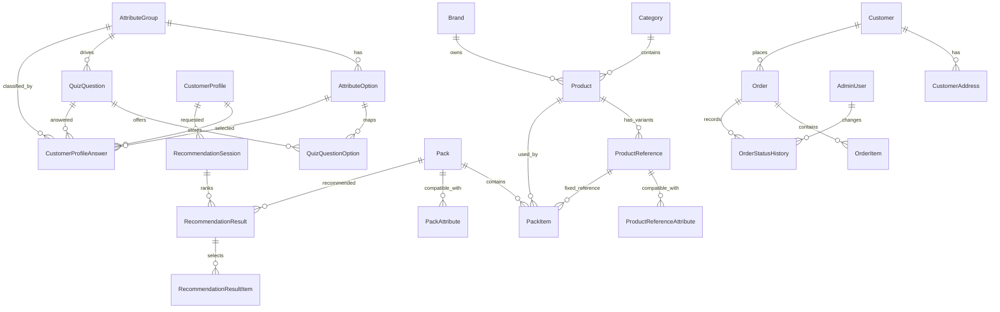

# Domain Model

Source of truth: `prisma/schema.prisma`

This document describes the current database model implemented through Task 13.

## Relation Overview

## Quiz And Attributes

### AttributeGroup

Purpose: groups a customer/product attribute such as skin color, undertone, style, or budget.

Main fields: `id`, `code`, `name`, `description`, `isCustomerAttribute`, `isProductAttribute`, `sortOrder`, `isActive`, timestamps.

Constraints: `code` is unique.

Relations: has options, quiz questions, profile answers, product reference attributes, pack attributes, and recommendation rules.

Lifecycle: active groups appear publicly; admin deletion is soft-deactivation.

Used by: attributes, quiz, products, packs, recommendations.

API exposure: public read API and protected admin API.

### AttributeOption

Purpose: selectable value inside an attribute group, such as `MEDIUM` for `SKIN_COLOR`.

Main fields: `id`, `attributeGroupId`, `code`, `label`, `description`, `imageUrl`, `sortOrder`, `isActive`.

Constraints: unique `(attributeGroupId, code)`.

Relations: belongs to one attribute group; used by quiz options, profile answers, product reference attributes, and pack attributes.

Lifecycle: active options appear publicly; admin deletion is soft-deactivation.

Used by: attributes, quiz, profile validation, compatibility scoring.

API exposure: public read API and protected admin API.

### QuizQuestion

Purpose: one quiz step linked to an attribute group.

Main fields: `id`, `attributeGroupId`, `questionText`, `helperText`, `selectionType`, `isRequired`, `stepOrder`, `isActive`, timestamps.

Constraints: no database unique active-question constraint, but service logic enforces one active question per attribute group.

Relations: optional attribute group, quiz options, and customer profile answers.

Lifecycle: active questions appear publicly; admin deletion is soft-deactivation.

Used by: quiz, customer profile creation.

API exposure: public read API and protected admin API.

### QuizQuestionOption

Purpose: maps a quiz question to selectable attribute options with optional display overrides.

Main fields: `id`, `questionId`, `attributeOptionId`, `displayLabel`, `displayImageUrl`, `sortOrder`, `isActive`.

Constraints: unique `(questionId, attributeOptionId)`.

Relations: belongs to one quiz question and one attribute option.

Lifecycle: managed through quiz question create/update flows.

Used by: public quiz questions and profile validation.

API exposure: nested under quiz APIs; no direct endpoint.

### CustomerProfile

Purpose: stores one anonymous customer quiz profile.

Main fields: `id`, `sessionToken`, `sourceChannel`, `algorithmVersion`, timestamps.

Constraints: `sessionToken` is unique.

Relations: has profile answers, recommendation sessions, orders, and customer events.

Lifecycle: created by `POST /quiz/profiles`; used by recommendations and orders.

Used by: quiz, recommendations, orders.

API exposure: public create API; no admin CRUD.

### CustomerProfileAnswer

Purpose: stores a selected attribute option for one customer profile and quiz question.

Main fields: `id`, `customerProfileId`, `questionId`, `attributeGroupId`, `attributeOptionId`, `valueText`, `createdAt`.

Constraints: indexes support profile, question, group, and option lookup.

Relations: belongs to profile, question, group, and optional option.

Lifecycle: created transactionally with a customer profile.

Used by: recommendations and audit/history.

API exposure: nested through profile creation and recommendation behavior; no direct endpoint.

## Catalog

### Category

Purpose: groups products in a hierarchical catalog.

Main fields: `id`, `parentId`, `code`, `name`, `description`, `imageUrl`, `sortOrder`, `isActive`, timestamps.

Constraints: `code` is unique; parent is nullable.

Relations: self-referencing parent/children and products.

Lifecycle: admin-managed; deletion is soft-deactivation.

Used by: products.

API exposure: protected admin API; public product responses include category summaries.

### Brand

Purpose: product brand.

Main fields: `id`, `name`, `description`, `logoUrl`, `isActive`, timestamps.

Constraints: `name` is unique.

Relations: has products.

Lifecycle: admin-managed; deletion is soft-deactivation.

Used by: products.

API exposure: protected admin API; public product responses include brand summaries.

### Product

Purpose: sellable catalog product, such as foundation or mascara.

Main fields: `id`, `categoryId`, `brandId`, `name`, `slug`, `description`, `basePrice`, `costPrice`, `currency`, `mainImageUrl`, `status`, `isActive`, timestamps.

Constraints: `slug` is unique.

Relations: belongs to category and optional brand; has references, pack items, recommendation result items, and order items.

Lifecycle: admin-managed; archive sets `status = ARCHIVED` and `isActive = false`.

Used by: products, packs, recommendations, orders.

API exposure: public read API and protected admin API.

### ProductReference

Purpose: product variant/reference, such as a shade.

Main fields: `id`, `productId`, `referenceCode`, `referenceName`, `barcode`, `sku`, `priceOverride`, `priceDelta`, `imageUrl`, stock fields, `isDefault`, `isActive`, timestamps.

Constraints: unique `(productId, referenceCode)`, unique `barcode`, unique `sku`.

Relations: belongs to product; has compatibility attributes; used by pack items, recommendation items, and order items.

Lifecycle: admin-managed; deletion is soft-deactivation.

Used by: product catalog, reference selection, order snapshots.

API exposure: protected admin API; nested public product/pack/recommendation responses.

### ProductReferenceAttribute

Purpose: compatibility rule between a product reference and an attribute option.

Main fields: `id`, `productReferenceId`, `attributeGroupId`, `attributeOptionId`, `matchType`, `scoreValue`, `isHardFilter`, `createdAt`.

Constraints: unique `(productReferenceId, attributeGroupId, attributeOptionId)`.

Relations: belongs to product reference, attribute group, and attribute option.

Lifecycle: replaced through product reference create/update flows.

Used by: recommendation item scoring.

API exposure: nested under product reference APIs.

## Packs

### Pack

Purpose: recommended product bundle.

Main fields: `id`, `name`, `slug`, `description`, `mainImageUrl`, `priceMode`, price/discount/budget fields, `currency`, `priority`, `status`, `isActive`, timestamps.

Constraints: `slug` is unique.

Relations: has pack items, pack attributes, recommendation results, orders, and order items.

Lifecycle: admin-managed; archive sets `status = ARCHIVED` and `isActive = false`.

Used by: public packs, recommendations, orders.

API exposure: public read API and protected admin API.

### PackItem

Purpose: product requirement inside a pack.

Main fields: `id`, `packId`, `productId`, `productReferenceId`, `quantity`, `selectionMode`, `isRequired`, `sortOrder`, timestamps.

Constraints: service-level validation enforces selection-mode rules.

Relations: belongs to pack and product; optionally links a fixed product reference.

Lifecycle: replaced transactionally through pack update/create flows.

Used by: recommendations and order creation.

API exposure: nested under pack APIs.

### PackAttribute

Purpose: compatibility rule between a pack and an attribute option.

Main fields: `id`, `packId`, `attributeGroupId`, `attributeOptionId`, `matchType`, `scoreValue`, `isHardFilter`, `createdAt`.

Constraints: unique `(packId, attributeGroupId, attributeOptionId)`.

Relations: belongs to pack, attribute group, and attribute option.

Lifecycle: replaced transactionally through pack update/create flows.

Used by: recommendation pack scoring and hard filters.

API exposure: nested under pack APIs.

## Recommendations

### RecommendationRule

Purpose: configurable scoring rule for the recommendation engine.

Main fields: `id`, `code`, `name`, `targetType`, `attributeGroupId`, `conditionType`, `scoreValue`, `weight`, `isActive`, timestamps.

Constraints: `code` is unique.

Relations: optionally belongs to an attribute group.

Lifecycle: admin-managed; deletion is soft-deactivation.

Used by: recommendation engine and admin preview.

API exposure: protected admin API.

### RecommendationSession

Purpose: one persisted recommendation run for a profile.

Main fields: `id`, `customerProfileId`, `algorithmVersion`, candidate/recommended counts, `status`, `createdAt`.

Constraints: indexed by profile, status, and creation time.

Relations: belongs to customer profile; has recommendation results.

Lifecycle: created by `POST /recommendations`.

Used by: recommendation retrieval and order conversion.

API exposure: public create/read through recommendation endpoints.

### RecommendationResult

Purpose: ranked pack result inside a session.

Main fields: `id`, `recommendationSessionId`, `packId`, `rank`, `totalScore`, `matchPercentage`, `isSelected`, `reasonSummary`, `reasonJson`, `createdAt`.

Constraints: unique `(recommendationSessionId, packId)`.

Relations: belongs to session and pack; has result items and orders.

Lifecycle: created by recommendation generation; marked selected by order creation.

Used by: orders and recommendation display.

API exposure: public recommendation responses; no direct CRUD.

### RecommendationResultItem

Purpose: selected product reference for one pack item in a recommendation result.

Main fields: `id`, `recommendationResultId`, `packItemId`, `productId`, `selectedProductReferenceId`, `quantity`, `itemScore`, `reasonJson`, `createdAt`.

Constraints: indexed by result, pack item, product, and selected reference.

Relations: belongs to recommendation result, pack item, product, and selected reference.

Lifecycle: created by recommendation generation.

Used by: order item creation.

API exposure: nested under recommendation responses.

## Customers And Orders

### Customer

Purpose: order customer identity by phone.

Main fields: `id`, `fullName`, `phone`, `whatsappPhone`, `email`, timestamps.

Constraints: `phone` is unique.

Relations: has addresses, orders, events, and messages.

Lifecycle: created or reused by `POST /orders`.

Used by: orders and future messaging/events.

API exposure: no direct API; nested in admin order details.

### CustomerAddress

Purpose: delivery address for a customer.

Main fields: `id`, `customerId`, `city`, `addressLine`, `extraInfo`, `isDefault`, timestamps.

Constraints: indexed by customer and city.

Relations: belongs to customer; used by orders.

Lifecycle: created by `POST /orders`; previous defaults are unset.

Used by: order fulfillment.

API exposure: no direct API; nested in admin order details.

### Order

Purpose: Cash on Delivery order created from a selected recommendation result.

Main fields: `id`, `orderNumber`, customer/profile/recommendation/pack/address IDs, payment fields, status, amount fields, `currency`, `notes`, timestamps.

Constraints: `orderNumber` is unique.

Relations: belongs to customer, optional profile, optional recommendation result, selected pack, and address; has items, status history, and messages.

Lifecycle: created by public order API; status updated by admin workflow.

Used by: public safe order summary and admin order management.

API exposure: public create/safe read API and protected admin read/status API.

### OrderItem

Purpose: immutable-ish order snapshot of selected products/references and prices.

Main fields: `id`, `orderId`, `packId`, `productId`, `productReferenceId`, product/reference snapshots, unit price, quantity, total price, `createdAt`.

Constraints: indexed by order, pack, product, and reference.

Relations: belongs to order, optional pack, product, and product reference.

Lifecycle: created with an order.

Used by: admin order details and fulfillment.

API exposure: nested under order responses; no direct CRUD.

### OrderStatusHistory

Purpose: audit trail for order status changes.

Main fields: `id`, `orderId`, `oldStatus`, `newStatus`, `changedByAdminId`, `comment`, `createdAt`.

Constraints: indexed by order, admin, status, and creation time.

Relations: belongs to order and optional admin user.

Lifecycle: created during order creation and admin status updates.

Used by: admin order audit/history.

API exposure: nested in admin order detail only.

## Administration

### AdminUser

Purpose: authenticated backend operator.

Main fields: `id`, `fullName`, `email`, `passwordHash`, `role`, `isActive`, `lastLoginAt`, timestamps.

Constraints: `email` is unique.

Relations: has order status changes.

Lifecycle: created/updated by local script `npm run admin:create`; no CRUD API.

Used by: authentication, authorization, order status audit.

API exposure: login/current-admin response only; password hash is never exposed.

## Future/Internal Entities

### CustomerEvent

Purpose: future analytics/event log tied to customer profiles or customers.

Main fields: `id`, `customerProfileId`, `customerId`, `eventType`, `metadata`, `createdAt`.

Relations: optional customer profile and optional customer.

Lifecycle: not currently written by implemented APIs.

API exposure: internal-only.

### MessageLog

Purpose: future outbound/inbound message tracking.

Main fields: `id`, `customerId`, `orderId`, `channel`, `messageType`, `recipient`, `status`, `providerMessageId`, `payloadJson`, `sentAt`, `createdAt`.

Relations: optional customer and optional order.

Lifecycle: not currently written by implemented APIs.

API exposure: internal-only.

## Enums

### SourceChannel

Meaning: where a customer/profile originated.

Values: `INSTAGRAM`, `WHATSAPP`, `TIKTOK`, `FACEBOOK`, `DIRECT`, `OTHER`.

Used by: `CustomerProfile`, admin order filters.

### SelectionType

Meaning: quiz answer selection mode.

Values: `SINGLE`, `MULTIPLE`.

Used by: `QuizQuestion`.

### ProductStatus

Meaning: product lifecycle state.

Values: `DRAFT`, `ACTIVE`, `ARCHIVED`.

Used by: `Product`.

### PackStatus

Meaning: pack lifecycle state.

Values: `DRAFT`, `ACTIVE`, `ARCHIVED`.

Used by: `Pack`.

### PriceMode

Meaning: how pack price is calculated.

Values: `FIXED`, `SUM_ITEMS`, `SUM_ITEMS_WITH_DISCOUNT`.

Used by: `Pack` and order price calculation.

### SelectionMode

Meaning: how a pack item selects a product reference.

Values: `FIXED_REFERENCE`, `AUTO_BEST_REFERENCE`, `CUSTOMER_CHOICE`.

Used by: `PackItem` and recommendation item selection.

### MatchType

Meaning: compatibility behavior for an attribute match row.

Values: `COMPATIBLE`, `NOT_COMPATIBLE`, `BOOST`.

Used by: product reference attributes and pack attributes.

### RecommendationTargetType

Meaning: target level of a recommendation rule.

Values: `PACK`, `PRODUCT`, `REFERENCE`.

Used by: `RecommendationRule`.

### RecommendationConditionType

Meaning: rule condition behavior.

Values: `MUST_MATCH`, `SHOULD_MATCH`, `EXCLUDE_IF_MATCH`.

Used by: `RecommendationRule`.

### RecommendationStatus

Meaning: lifecycle state of a recommendation session.

Values: `PENDING`, `PROCESSING`, `COMPLETED`, `FAILED`.

Used by: `RecommendationSession`.

### PaymentMethod

Meaning: order payment method.

Values: `CASH_ON_DELIVERY`.

Used by: `Order`.

### PaymentStatus

Meaning: payment lifecycle state.

Values: `UNPAID`, `PAID`, `REFUNDED`.

Used by: `Order` and admin order workflow.

### OrderStatus

Meaning: fulfillment lifecycle state.

Values: `PENDING_CONFIRMATION`, `CONFIRMED`, `PREPARING`, `SHIPPED`, `DELIVERED`, `CANCELED`, `RETURNED`.

Used by: `Order`, `OrderStatusHistory`, admin order workflow.

### AdminRole

Meaning: admin authorization role.

Values: `OWNER`, `ADMIN`, `STAFF`.

Used by: `AdminUser`, JWT payload, `RolesGuard`.

### MessageChannel

Meaning: future messaging channel.

Values: `WHATSAPP`, `SMS`, `EMAIL`.

Used by: `MessageLog`.

### MessageStatus

Meaning: future message delivery state.

Values: `PENDING`, `SENT`, `FAILED`.

Used by: `MessageLog`.
